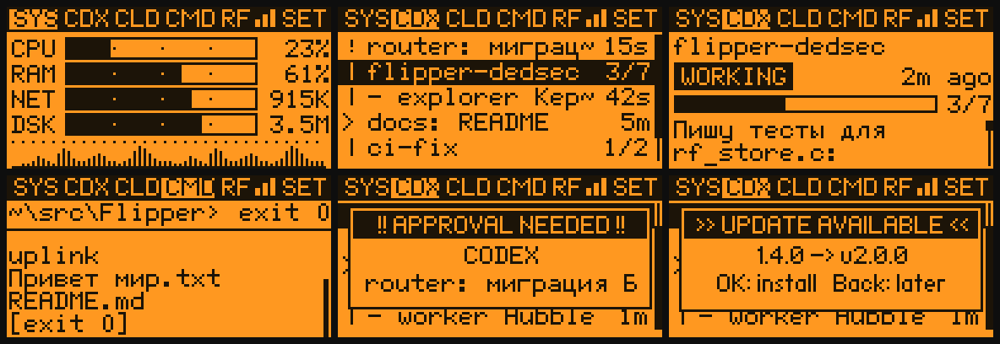

# Flipper Zero — DedSec / Watch Dogs pack

A Flipper Zero project in a Watch Dogs / DedSec style for **Unleashed firmware** (`unlshd-093c`, API 88.9):

1. **DedSec Uplink** — a Flipper app + Windows tray companion talking over Bluetooth LE:
   a live PC monitor, a status board for your **Codex** and **Claude Code** sessions, and a
   pocket **cmd.exe**.
2. **Desktop animations** — nine original 1-bit Watch Dogs style idle animations for the dolphin desktop.
3. **RF Signal Hunter** — a passive Sub-GHz Scout vertical slice plus a desktop event store for
   stable event IDs, structural fingerprints, family grouping and idempotent upload acknowledgements.



*SYS with autoscaled network/disk bars · CMD running a command on the PC · settings · inverted theme*


## DedSec Uplink

| Tab | What it shows |
|---|---|
| **SYS** | CPU, RAM, network and disk load (bars with autoscale, or text) and a CPU history graph |
| **CDX** | Codex sessions (`codex --profile …` and the desktop app): working / needs you / your turn / idle, sub-agents, what each is doing |
| **CLD** | Claude Code sessions (CLI and the Code tab of Claude Desktop), progress from the todo list |
| **CMD** | A real remote shell: type on the Flipper, it runs in a persistent `cmd.exe` on the PC, output and exit code come back |

- **Vibrates** when a session needs you (question / approval, or the agent finished its turn) and when the console replies.
- **Cyrillic** session names, details and console output (embedded UTF-8 font).
- **Over-the-air updates**: the companion checks GitHub releases, the Flipper offers the update and installs it over BLE, then restarts itself.
- **Settings** on the Flipper: vibration, LED, screen wake, indicators (bars/text), theme (normal/inverted), font size, tab order, auto-update.
- Companion: tray icon, Windows autostart, optional Claude Code hooks for precise state.

Full documentation: **[uplink/README.md](uplink/README.md)**.

### Install

1. Download from [Releases](https://github.com/liullinil/flipper-dedsec/releases/latest):
   - `dedsec_uplink.fap` → copy to `SD/apps/Bluetooth/` on the Flipper (qFlipper, the mobile app or the SD card).
     Later versions arrive over the air.
   - `DedSecUplink.exe` → run it on Windows (no Python needed). It sits in the tray and finds the Flipper by itself.
2. On the Flipper: **Apps → Bluetooth → DedSec Uplink**.

## Desktop animations

Original pixel art *inspired by* the games (not copied assets): WATCH_DOGS wordmark, Blume/ctOS boot, DEDSEC
decrypt, hooded skull, Legion W, brush-ring W, spray WD2, LED operator mask, ctOS breach terminal.
Details, previews and how they rotate: **[assets/README.md](assets/README.md)**.

## Repository

| Path | Contents |
|---|---|
| [`apps/dedsec_uplink`](apps/dedsec_uplink) | The Flipper app (C, built with `ufbt`) |
| [`uplink`](uplink) | The Windows companion (Python; also built as a single `.exe`) |
| [`assets`](assets) | Animation sources, built `.bm` frames, previews |
| [`apps/rf_signal_hunter`](apps/rf_signal_hunter) | Passive Sub-GHz Scout FAP (RX only) |
| [`tools`](tools) | Build scripts and Flipper USB helpers |

## Build from source

```bash
cd apps/dedsec_uplink && ufbt                     # -> dist/dedsec_uplink.fap
python tools/build_anims.py                       # -> assets/dolphin/*
python -m pip install -r uplink/requirements.txt
pythonw uplink/dedsec_uplink.pyw                  # or build the .exe, see uplink/README.md
```
