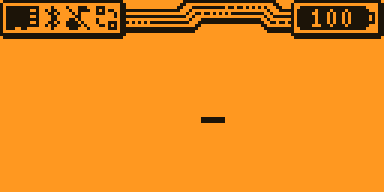
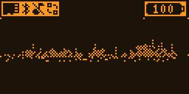
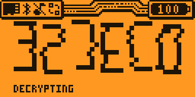
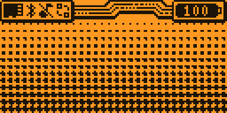
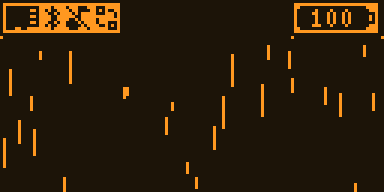
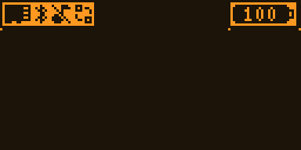
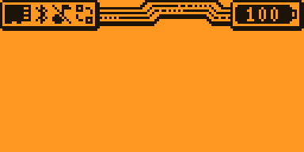
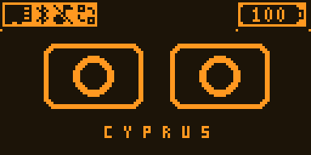
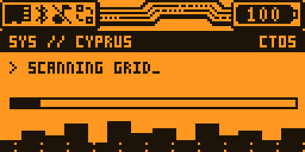

# Watch Dogs style desktop animations

Nine 1-bit 128×64 idle animations for the Flipper Zero dolphin desktop (Unleashed `unlshd-093c`).
Original pixel art inspired by the games — not copied Ubisoft assets. Previews include the desktop status bar.



| Animation | Preview | What happens |
|---|---|---|
| `WD_Wordmark_128x64` |  | The underscore blinks like a cursor, WATCH_DOGS tears into place, "EVERYTHING IS CONNECTED" |
| `WD_Blume_ctOS_128x64` |  | The Blume cube draws itself over a noisy skyline, "BLUME", "CTOS 2.0 // ONLINE" |
| `WD_DedSec_Decrypt_128x64` |  | Tall pixel DEDSEC letters decrypt out of mirrored junk, "> JOIN US_" |
| `WD_DedSec_Hood_128x64` |  | Hooded skull over a halftone gradient, graffiti DEDSEC tag, glowing eyes |
| `WD_Legion_128x64` |  | A Legion-style W assembles from vertical glitch rain, HUD details |
| `WD_Emblem_128x64` |  | A brush ring sweeps around, the W is scratched in |
| `WD2_Spray_128x64` |  | A spray-painted W with drips, the WATCH_DOGS 2 banner slams in |
| `WD_Operator_128x64` |  | LED mask eyes: `o o`, `> <`, `^ ^`, `x x`, `+ +` |
| `WD_Breach_128x64` |  | ctOS breach terminal: SCANNING → BYPASS → ACCESS GRANTED |

## How pacing and rotation work

- **Pace**: 2 frames per second, like the stock animations. Holds come from repeating a frame in
  `Frames order` (main frames stay 2–3 s, glitch flashes 0.5 s).
- **Rotation**: Unleashed has no "cycle animations" setting. The firmware picks a new random idle animation
  when the current one's `Duration` runs out (stock animations use 3600 s). Ours use a whole number of loops
  close to 30 s, so the switch lands on the end of a loop.
- **The built-in TV dolphin** (`L1_Tv_128x47`, weight 3, shown for an hour) is always in the random pool and
  can't be removed without reflashing. Manifest weights are 8-bit (max 255), but repeated entries add up:
  each animation is listed 16 times with weight 255, which cuts the dolphin's chance per switch from 6 % to
  ~0.01 %. Right after boot, if the SD card isn't ready yet, it can still show up — a reboot fixes it.
- **Status bar**: the desktop draws its icons and battery over the top 13 rows and is partly transparent,
  so the top of every frame is plain background and the art lives in rows 13–63.

## Build and upload

```bash
python tools/build_anims.py       # frames, .bm, meta.txt, manifest, previews
python tools/upload_anims.py      # upload over USB with md5 checks (no reboot needed)
```

The animation manager re-reads the manifest on every switch. `--reboot` restarts the Flipper right away,
`--manifest-only` uploads just the manifest.

Code: [`tools/wdanim/`](../tools/wdanim) — one file per scene, `core.py` holds the effects, packing and
previews. Fonts come from Windows (Impact, Haettenschweiler); everything else is drawn in code with PIL.
Show time is `TARGET_SHOW_S` in `core.py`; weights and repeats are in `tools/build_anims.py`.

| Folder | Contents |
|---|---|
| `dolphin/` | exactly what goes to `/ext/dolphin` on the SD card (`.bm` frames, `meta.txt`, `manifest.txt`) |
| `frames/` | unique frames as PNG, for review and editing |
| `previews/` | LCD-coloured GIFs and contact sheets |

## Restore the stock animations

Upload a stock `manifest.txt` back to `/ext/dolphin/manifest.txt` (the stock animation folders are untouched),
or reinstall the firmware.
