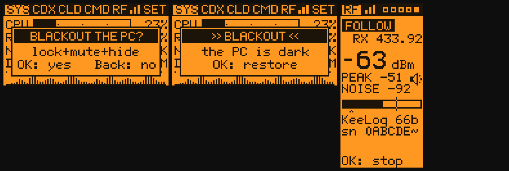
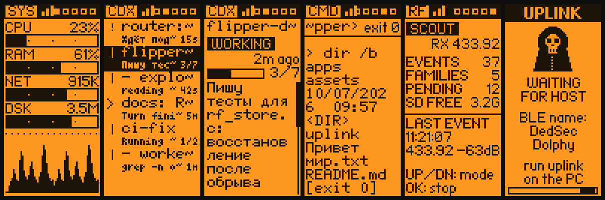
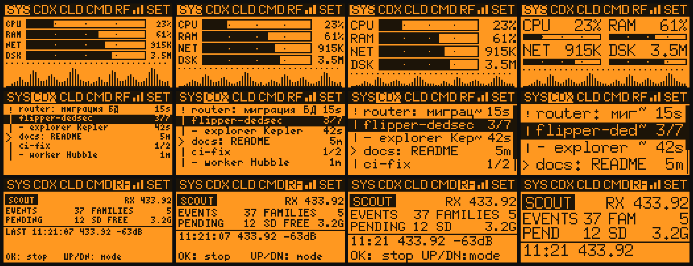
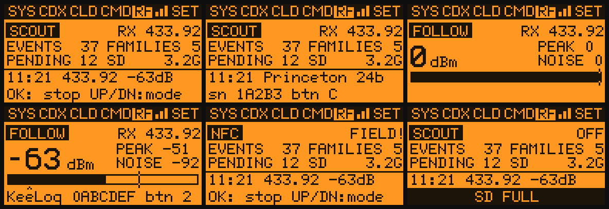
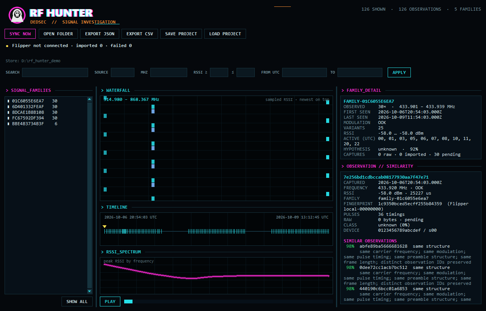
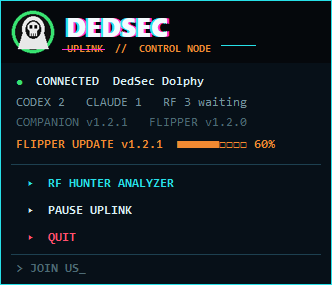

# DedSec Uplink

A Flipper Zero app plus a Windows tray companion that talk over Bluetooth LE (no pairing):
a live PC monitor, a status board for **Codex** and **Claude Code** sessions, a pocket **cmd.exe**, and
**RF Hunter** — a passive Sub-GHz / NFC-field logger whose records the companion imports and shows in
an investigation window.


*SYS · Codex sessions · session details · CMD · approval alert · update offer
(rendered from the app's drawing code with [`tools/uplink_render`](../tools/uplink_render))*

| Part | Where | Does |
|---|---|---|
| Flipper app | [`apps/dedsec_uplink`](../apps/dedsec_uplink) → `SD/apps/Bluetooth/dedsec_uplink.fap` | Own BLE service, the screens, vibration, keyboard for commands, RF Hunter engine, self-update |
| Companion | `uplink/` (Python) or `DedSecUplink.exe` | Tray panel; collects load and agent state, runs commands, imports RF records, RF analyzer, keeps itself and the Flipper app up to date |

Target: Flipper Zero on Unleashed `unlshd-093c` (API 88.9), Windows 10/11 with Bluetooth LE.

## Tabs

- **SYS** — CPU, RAM, network, disk. *Bars* mode autoscales network and disk to a rolling maximum
  (there is no fixed ceiling); *Text* mode shows exact up/down and read/write rates. CPU history graph.
  OK here is **Blackout**: the PC's own DedSec lock screen (see below).
- **CDX** — Codex sessions (`codex --profile router` in a terminal and the Codex desktop app). Sub-agents
  appear as `- name nickname` rows under their root; the root shows `done/total` sub-agents.
- **CLD** — Claude Code sessions (CLI and the Code tab of Claude Desktop); progress from the todo list.
- **CMD** — remote shell. Type a command on the Flipper, it runs on the PC, the output and `[exit N]` come back.
  On Windows the companion uses a ConPTY pseudo-terminal, so interactive programs such as `codex`
  can start. While a command is running, press OK again to send another line to its stdin.
- **RF** — RF Hunter, see below. Unlike the other tabs it works without the PC.

Status icons: spinner = working · blinking `!` = needs your answer or approval · `>_` = your turn.
Idle sessions are left out of the lists. A finished session (`>_`) stays until you open its details
and close them again; it comes back when it needs you next time.
Session names, details and console output support **Cyrillic** in every font size.

The header shows the tabs (a blinking `!` marks a tab that needs you), three signal bars for the link
(one bar = the PC has gone quiet for a few seconds) and `SET` for the settings.

## Controls

| Key | Action |
|---|---|
| ◀ ▶ | switch tabs; ▶ on the last tab opens the settings |
| ▲ ▼ | select a session · scroll the details · scroll the console |
| OK | open / close session details; on CMD: type a command, or input for the running one; on RF: start / stop; on SYS: Blackout the PC (OK again to confirm, or restore it) |
| ▲ ▼ on RF | change the RF mode |
| OK (hold) | settings |
| Back | back / exit; on CMD while a command runs: cancel it (Ctrl+C) |

When a session starts waiting for you the Flipper vibrates, blinks the LED and shows
`!! APPROVAL NEEDED !!` (a question or approval) or `>> YOUR TURN <<` (the agent finished its turn).
OK on the banner opens that session.

## Blackout



OK on the SYS tab asks `BLACKOUT THE PC?`; OK again and the companion minimises every window, mutes the
sound and covers every monitor with a DedSec lock screen: a glitching wordmark, code rain, the profiler
reticle or a scanned skyline (picked at random each time), the clock, a ticker of taglines, a **PIN**
field and a **POWER OFF** button (click it twice). The PIN unlocks it; so does OK on the Flipper's SYS tab,
which now shows `>> BLACKOUT <<` — the Flipper is the key. On unlock the windows come back where they were
and the sound is unmuted (if it was on). The Windows key and Alt+Tab / Alt+F4 are swallowed while the
screen is up; Ctrl+Alt+Del still works, this is a curtain, not a Windows credential provider.

**Auto Blackout** (tray panel, off by default): the PC blacks out by itself when the Flipper's link is
lost for 45 s, which is what happens when you walk away with the Flipper in your pocket. It arms ten
minutes after the companion starts (the panel shows `ARMS IN n MIN`), so after a reboot there is time
to turn it off; closing the Uplink app on the Flipper on purpose, or pausing the uplink, never triggers
it. The first use asks for a PIN (4-12 digits, `SET BLACKOUT PIN` in the panel changes it later); it is
stored as a salted PBKDF2 hash in `config.json`. `BLACKOUT NOW` in the panel locks straight away.

## Vertical mode and font sizes

*Settings → Orientation → Vertical* turns the main screens by 90° for holding the Flipper upright:
sessions get two lines each (name, then progress and what the agent is doing), details and console
output wrap to the narrow screen. The on-screen keyboard and the settings list stay horizontal.



*Settings → Font size* sets the text of every tab, smallest to largest: **Micro** (4×6, 7 sessions per
screen), **Small** (5×7, 6), **Normal** (6×12, 5) and **Large** (7×13, 4), all with Cyrillic. SYS
meters, session lists and details, the console, the RF tab and the alerts follow it and rearrange
themselves: Large puts the SYS meters in two columns, shortens labels (`FAM`, `PEND`) and drops the key
hints when the screen runs out. Only the tab bar keeps its size.



## Settings (hold OK)

Saved to `SD/apps_data/dedsec_uplink/.uplink.settings`.

| Setting | Values |
|---|---|
| Vibration | on / off (works even in Unleashed stealth mode) |
| Vibrate on cmd reply | on / off |
| LED alerts | on / off |
| Wake screen on alert | on / off |
| Indicators | Bars / Text |
| Font size | Micro / Small / Normal / Large — for everything below the tab bar |
| Orientation | Horizontal / Vertical (main screens) |
| Tab 1…5 | SYS / CDX / CLD / CMD / RF / Off — order and visibility of the tabs |
| RF band | All / 433 / 315 / 868 MHz |
| RF trigger level | −100 … −40 dBm (default −75): weaker bursts are ignored; the Flipper also stays 8 dB above the noise it measures on each frequency |
| RF hop time | 100 … 2000 ms on each frequency in Scout |
| RF capture window | 250 … 2000 ms, the longest single capture |
| RF vibrate on signal | on / off: a short pulse on a signal (at most once a second), and a short cyan LED blink every 4 s while there are captures you have not looked at (opening the RF tab stops it) |
| RF Geiger clicks | on / off: the speaker clicks of the Follow screen's Geiger counter (the meter stays either way) |
| RF after import | Delete / Keep — what happens to a record on the SD card once the PC has it |
| RF on at app start | on / off |
| RF import by PC | on / off |
| Version | shows the installed version; OK installs a pending update |

## Pocket cmd.exe

On the CMD tab press OK, type a command on the on-screen keyboard and choose **save**. It runs in one
persistent `cmd.exe` on the PC, so `cd` and environment changes stick between commands. Output streams back
line by line; at the end you get `[exit N]` with the real exit code and a short vibration. Back cancels a
running command: Ctrl+C first, and after 2 seconds the command and everything it started are closed.

- The Flipper keyboard capitalizes the first letter (`Ver`, `Dir`). Windows commands are case-insensitive.
- Up to 400 output lines per command; ordinary commands running over 2 minutes are stopped.
  Interactive programs (Python, Codex, a `set /p` question) stay until you answer with OK or press Back.
- The shell runs in a pseudo-terminal (ConPTY) in UTF-8 (`chcp 65001`), so Cyrillic names come through.
- cmd by default; `"shell": "powershell"` in `%LOCALAPPDATA%\DedSecUplink\config.json` switches it.
- Programs launched with `start` from this shell close when it stops or the companion quits.

**Security.** The BLE link has no pairing, so anyone in Bluetooth range who knows the protocol could send
commands. Every command is logged and output is capped; if you don't use CMD, turn the shell off with
`"cmd_enabled": false` in `%LOCALAPPDATA%\DedSecUplink\config.json`.

## Over-the-air updates

The companion checks the latest [GitHub release](https://github.com/liullinil/flipper-dedsec/releases)
every 30 minutes. When the connected Flipper runs an older app it installs the new one by itself:

1. it downloads `dedsec_uplink.fap` from the release;
2. it streams the file over BLE in base64 chunks with an acknowledgement window (lost chunks are re-sent;
   apps older than 1.2.0 get one chunk at a time, every BLE write stays within the Flipper's 243-byte buffer);
3. the app writes it next to itself, checks size and CRC-32, replaces its own `.fap` and restarts.

The Flipper shows `UPDATING` with the progress; Back cancels (the companion tries again 10 minutes later).
The first version with OTA support (v1.1.0) has to be installed once by hand.

## RF Hunter

A passive RF logger in the **RF** tab. The Flipper only listens: it never transmits, replays or polls.



| Mode | What it does |
|---|---|
| **Scout** | hops over 315 / 433.92 / 868.35 MHz (or the chosen band) and records every burst above the trigger level |
| **Capture** | stays on one frequency (the last event's) and records every burst |
| **Follow** | stays on the last event's frequency, matches each burst against it (same decoded transmitter, or the same pulse shape) and vibrates twice on a match; the screen becomes a **Geiger counter**: the live RSSI big, the peak and the noise floor, a -100..-30 dBm bar, and speaker clicks that quicken from a slow background tick to a crackle as you get closer to the source (*RF Geiger clicks* turns the sound off; the meter stays) |
| **NFC** | the NFC chip's external-field detector: logs when a reader's 13.56 MHz field appears and for how long (no polling, no UID) |

Each event is one JSON record on the SD card (`apps_data/dedsec_uplink/rf/events/`) with the exact time,
frequency, RSSI min/avg/max, duration and pulse timings. The tab counts events and distinct signal
families, shows what still waits for the PC, free space and the last event. It works without the PC: start
it and put the Flipper in a pocket.

**What was that?** Every capture is decoded on the Flipper before it is saved, from the pulse timings
alone, and the tab says so: `12:41 KeeLoq 66b -63dB` with `sn 0ABCDEF btn 2` under it, `Princeton 24b` with
`sn 1A2B3 btn C`, `Nexus-TH` with `+23.4C 45% ch1`. Recognised: Princeton / PT2262 / EV1527 (cheap remotes,
doorbells, alarm pagers), CAME and Holtek HT12E, Nice FLO, Nice FloR-S, KeeLoq (DoorHan, AN-Motors, car
alarms and garage doors: the serial and the button are in the clear, the hopping code changes every press),
Starline, Linear, Hormann HSM, GateTX, FAAC SLH, Holtek 40-bit and Nexus / Rubicson weather sensors
(temperature, humidity, channel). Anything else is described as what it is: `OOK 25sym` with
`te 420us 25sym x4 same` (base pulse, symbols per frame, how often the frame repeated and whether every
copy was identical, i.e. a fixed code), or `carrier` when there was no on/off keying at all (FSK key
fobs, TPMS, LoRa). Nothing is replayed: this is reading, not talking.

Only real transmissions become events. The Flipper learns the noise floor of each frequency and triggers at
least 8 dB above it (next to a PC the 315 MHz floor can sit at −77 dBm, right at the default trigger level),
and a burst is kept only if it shows on/off keyed edges over a few RSSI samples (16 edges in 10 ms or more) or
a carrier that stays up for 50 ms. Interference blips are dropped instead of filling the journal.

When the companion is connected it imports the records over the same BLE link, checks size and CRC-32,
writes them to `%LOCALAPPDATA%\DedSecUplink\rf_hunter` and only then tells the Flipper, which deletes them
(or keeps them, see *RF after import*). An interrupted import continues where it stopped; a record is never
imported twice.

**RF analyzer** (tray panel → *RF Hunter analyzer*), meant to be read at a glance:

- a summary: signals, noise, NFC fields, frequencies, the last capture and the strongest one;
- **ACTIVITY**: time across, one lane per band (315 / 433 / 868, NFC), one dot per capture — bigger is
  longer, the colour is the strength, a hollow dot is noise; a click selects it;
- **CAPTURES**: every capture in local time with frequency, strength, length, recorded edges, its group
  (captures that look alike: #1 is the most frequent) and a verdict — the decoded protocol (`KeeLoq 66b`,
  `Princeton 24b`, `Nexus-TH`), *fixed code x4* / *signal* for unknown bursts, *carrier*, *noise* or
  *NFC field*; search, band chips and *hide noise* narrow the list;
- for the selected capture: the details — what it is (`KeeLoq 66-bit rolling code`, `sn 0ABCDEF btn 2`,
  the key, how many frames the capture holds and whether they were identical, the base pulse) with a plain
  explanation of what such a transmitter is, the **recorded pulses** drawn as a pulse train, the captures it
  **looks like**, and a note. Records made by older app versions are decoded by the companion itself.

Two buttons:

- **FLIPPER → PC** imports the Flipper's records now (it also happens by itself while connected).
- **FLIPPER ← PC** puts every record of this PC on the Flipper, to take them to another PC. Connect the
  Flipper to the other PC's companion and it imports them like the Flipper's own records; then they leave
  the Flipper (or a copy stays, see *RF after import*). Records the Flipper already holds are skipped, and the
  PC that brought them never imports them back. The RF tab counts them under PENDING until then.

Exports (JSON/CSV) and copied SD-card folders are on the command line. Details:
[RF_HUNTER_ANALYZER.md](RF_HUNTER_ANALYZER.md); the engine:
[RF_ENGINE.md](../apps/dedsec_uplink/RF_ENGINE.md); design and protocol:
[docs/rf_hunter_design.md](../docs/rf_hunter_design.md).



The Flipper's Sub-GHz radio is a narrowband receiver: the analyzer shows sampled events, not a continuous
spectrum, and RSSI helps a search but is not direction finding.

## Companion

### Run

- **No Python:** download `DedSecUplink.exe` from the release and run it.
- **From source:** `python -m pip install -r requirements.txt`, then `pythonw dedsec_uplink.pyw`.
  `bleak` is pinned to 0.22.3 because 1.x does not import on Python 3.9.0.

A hooded-skull icon appears in the tray (Windows may hide it under the `^` arrow next to the clock).
The ring shows the link: green connected, yellow searching, grey paused, red error.

A click on the icon (left or right) opens the DedSec panel: link and session status, RF records waiting on
the Flipper, versions, update progress, and *RF Hunter analyzer*, *Blackout now*, *Auto Blackout* (off /
arms in n min / armed), *Set / change Blackout PIN*, *Pause uplink*, *Quit*. `> JOIN US_` opens this
repository.



There is nothing to set up:

- **Start with Windows** and the **Claude Code hooks** are switched on at every start (if something turned
  them off, they come back).
- **Updates are automatic.** Every 30 minutes the companion checks the latest release. `DedSecUplink.exe`
  downloads its new version, swaps itself and restarts; a Flipper app older than the release gets the new
  `.fap` over Bluetooth while it is connected (a failed attempt is retried after 10 minutes).
- The remote shell is on and uses `cmd`; `%LOCALAPPDATA%\DedSecUplink\config.json` can switch it to
  `"shell": "powershell"` or turn it off with `"cmd_enabled": false`. The same file keeps the Blackout
  settings (`blackout_auto`, the hashed `blackout_pin`).

Command line (`.exe` or `.pyw`): `--console` (log to the console), `--dump` (print one data frame, no BLE),
`--install-autostart` / `--uninstall-autostart`, `--install-claude-hooks` / `--remove-claude-hooks`.
Log: `%LOCALAPPDATA%\DedSecUplink\uplink.log`; each self-update notes its steps in `update.log` next to it.
Only one copy runs at a time.

### Build the .exe

```bash
hook\build.bat                      # the native Claude Code hook (MSVC) -> hook/uplink_hook.exe
python -m pip install pyinstaller
python -m PyInstaller --onefile --windowed --name DedSecUplink --collect-submodules bleak \
    --collect-submodules bleak_winrt --collect-submodules winrt --hidden-import pystray._win32 \
    --add-binary "hook/uplink_hook.exe;." dedsec_uplink.pyw
```

### Where session state comes from

Nothing in Codex or Claude is changed; the companion only reads their logs.

**Codex** — `~/.codex/sessions/YYYY/MM/DD/rollout-*.jsonl` and names from `~/.codex/session_index.jsonl`:
`task_started` → working; `task_complete` → your turn (for 20 min), then idle; `request_user_input_async` →
a question waits for you; `*approval_request*` events → approval needed; reasoning summaries, commands and file
edits → "what it is doing"; sub-agents from `session_meta.source.subagent`.

**Claude Code** — `~/.claude/projects/*/*.jsonl`: a user prompt → working; `stop_hook_summary` / `end_turn` →
your turn; a pending `AskUserQuestion` / `ExitPlanMode` → waits for you; the session title, todo progress and
current step come from the transcript.

### Claude Code hooks (precise state)

Without hooks, permission prompts are guessed from the transcript. With hooks, Claude Code itself reports the
transitions. The companion installs them at every start; by hand: `--install-claude-hooks`, or:

```bash
python install_claude_hooks.py            # add
python install_claude_hooks.py --remove   # remove
```

This adds `Notification`, `Stop`, `SubagentStop` and `UserPromptSubmit` hooks to `~/.claude/settings.json`
(merged with your own hooks, a `settings.json.bak-*` backup is kept). Each hook appends one line to
`%LOCALAPPDATA%\DedSecUplink\claude_events.jsonl`. The hook is a tiny native program
(`hook/uplink_hook.c`, copied to `%LOCALAPPDATA%\DedSecUplink\uplink_hook.exe`) that takes about 20 ms, so
Claude does not wait for it; without it the Python script is used. Restart Claude Code sessions (or run
`/hooks`) after the first install.

## Protocol

Service `de5ec000-1d00-4a1e-8b5e-0f11e7ca1000`, advertised as 16-bit UUID `0xDED5`, name `DedSec <flipper name>`.
Text lines, `|`-separated, UTF-8.

PC → Flipper (write, `de5ec001-…`):

```
H|host                                   hello
S|cpu|ram|disk|rd|wr|up|dn|used|total    load, rates in KB/s
L|X|count                                list size (X = Codex, C = Claude)
I|X|idx|key|state|done|total|age|attn|name|detail
O|seq|text   X|seq|code   W|cwd           command output / exit code / shell directory
N|tag|size                               a newer release exists
UB|tag|size|crc32   UD|offset|base64   UE|tag     update transfer
Z|utc|tz_minutes                         PC clock (the Flipper derives its RTC offset for RF times)
RL|cursor   RR|id|offset   RA|id|size|crc32   RF import: list, read 120 bytes, acknowledge
BO|active|auto                           Blackout: the lock screen is up (1/0); auto 0 off, 1 arming, 2 armed
B                                        the PC is going away
```

Flipper → PC (notify, `de5ec002-…`):

```
C|seq|command   T|seq|text   K|seq       run / send stdin text / cancel a command
V|version                                app version (on connect and every 30 s)
U|tag   UA|written                       request an update / acknowledge bytes written
R|pending|stored|free_kb|state|errors    RF journal status
RI|next|id|size|crc32   RE   RD|id|offset|base64   RK|id   RX|code|text   RF import replies
BO|1   BO|0                              Blackout the PC / restore it (SYS tab)
BB                                       the app is closing on purpose (never an auto Blackout)
```

`state`: `W` working, `A` needs an answer or approval, `I` your turn, `S` idle.
`attn` grows every time a session starts waiting for you; the Flipper vibrates when it grows.

## Build the Flipper app

```bash
cd apps/dedsec_uplink
ufbt            # -> dist/dedsec_uplink.fap
ufbt launch     # install over USB and start
```

Notes for Unleashed 093c: the firmware only reports "connected" after pairing, so the link counts as alive
while data flows (8 s timeout). The default Bluetooth profile (for the phone) is restored when the app exits.
